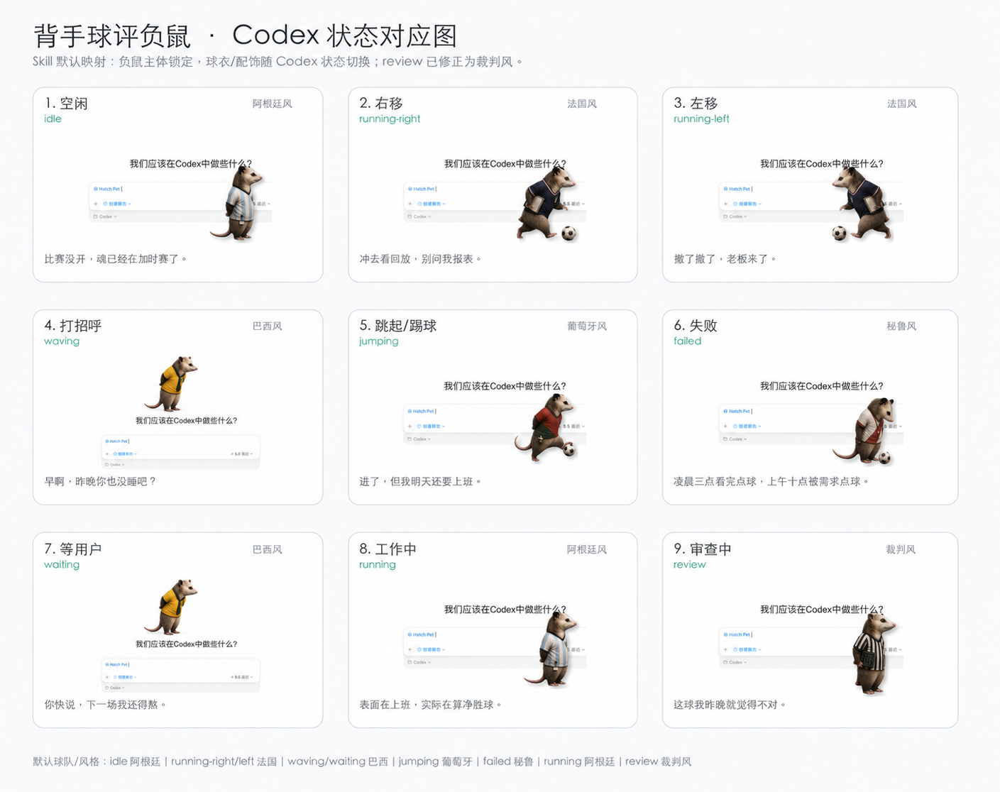
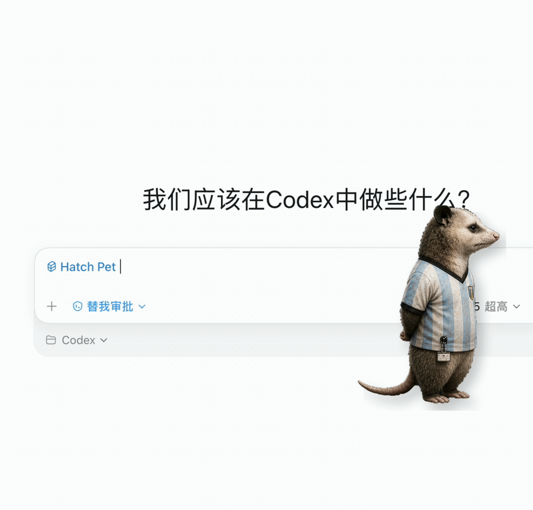

# World Cup Opossum Pet Skill

> 把世界杯赛程、球队风格和打工人看球状态，变成一只可安装、可二创的 Codex 负鼠宠物。
>
> 固定负鼠本体 | 动态多帧宠物 | 可改球衣/赛程牌/配置文案 | 9 个 Codex 状态 | 中国时间赛程

## 状态预览





## 这个仓库是什么

这是一个面向 Codex 的世界杯宠物 Skill。它不是通用生图 prompt，也不是单张表情包生成器，而是一个可以指导 Codex 生成、配置、安装和迭代“背手球评负鼠”的动态宠物 Skill。

重点：它的真正产出是 **Codex 动态宠物 spritesheet**。状态对应图和演示视频只是展示物料，不是最终产品本体。

核心设定是：负鼠本体固定，用户只改外层配置。

可改内容：

- 宠物名字
- 状态文案，作为配置和展示说明使用；Codex 原生宠物不会自动显示成气泡
- 球队风格
- 球衣对应状态
- 是否显示赛程
- 宠物大小和清晰度
- 中国时间赛程牌样式

不可默认改动：

- 负鼠主体
- 侧脸、背手、冷静疲惫气质
- 9 个 Codex 状态契约和动态多帧循环

## 适合谁用

这个 Skill 适合想在 Codex 里做宠物、状态反馈和轻量互动展示的人。

适合这些场景：

- 想给 Codex 做一个有记忆点的桌面宠物
- 想把 Codex 的工作状态变成可爱的动态反馈
- 想围绕世界杯做一个可复用、可改配置的宠物模板
- 想学习 Codex pet / Skill / spritesheet 的组织方式
- 想在不改负鼠主体的情况下，替换球队风格、配置文案和赛程牌

## 可以产出什么

默认会产出一套 Codex 宠物包，以及配套展示物料。

主要产出：

- 一个可安装的 Codex pet 文件夹
- `pet.json`
- `spritesheet-daily-board.png`，8 列 x 9 行动态图集
- `pet.config.json`
- 当前状态对应图，用于展示和说明
- 状态演示视频
- 黄色 waiting/waving 完整耳朵参考图
- review 默认使用裁判风，避免和阿根廷 idle/running 混淆

动态规则：

- 每一行对应一个 Codex 状态。
- 每个状态有 4-8 帧循环动画。
- Codex 运行时会根据状态切换不同动画行。
- `running-right` 和 `running-left` 必须是方向明确的动态移动状态。
- `idle / waiting / running / review / failed / waving / jumping` 都不能只做成静态截图。

## 怎么用

真正需要复制到 Codex skills 目录的是子目录：

```text
worldcup-opossum-pet/
```

安装示例：

```bash
mkdir -p "${CODEX_HOME:-$HOME/.codex}/skills"
cp -R ./worldcup-opossum-pet "${CODEX_HOME:-$HOME/.codex}/skills/"
```

安装后在 Codex 里使用：

```text
Use $worldcup-opossum-pet 安装世界杯负鼠宠物。
```

也可以要求它按你的偏好改配置：

```text
Use $worldcup-opossum-pet 把我的主队改成巴西风，保留赛程牌，配置文案更冷幽默一点。
```

只生成配置、不安装：

```text
Use $worldcup-opossum-pet 先不要安装。根据我的偏好生成一份 pet.config.json。
```

## 工作流程

这个 Skill 自己负责世界杯负鼠的规则、配置、文案和主题约束；真正的宠物生成、校验和安装由本地 `$hatch-pet` 接管。

标准流程：

1. 读取或生成 `pet.config.json`。
2. 锁定负鼠主体：侧脸、背手、疲惫球评气质不变。
3. 根据 Codex 的 9 个状态映射球衣、动作和配置文案。
4. 如果开启赛程牌，把中国时间赛程写进宠物画面。
5. 调用 `$hatch-pet` 生成 Codex 兼容的 spritesheet。
6. 运行 `$hatch-pet` 的 atlas 校验和状态图检查。
7. 安装到 `${CODEX_HOME:-$HOME/.codex}/pets/<pet-id>/`。
8. 在 Codex 宠物系统里刷新或切换到该宠物。

## 注意事项

- 下载这个 Skill 不会自动接管 Codex 宠物。
- 只有用户明确运行安装请求时，才会写入 Codex pets 目录。
- 这个 Skill 依赖本地已安装的 `$hatch-pet`。
- 配置文件只当数据读取，不执行其中的内容。
- **Codex 原生宠物目前只显示 spritesheet 动画，不会自动显示 `stateCopy` 状态文案气泡。**
- **赛程牌是构建时写进 spritesheet 的画面，不是宠物内部实时联网组件。**
- **如果配置了每日刷新任务，任务只会定时核对 fixture 数据、重建赛程牌，并覆盖安装新的 `spritesheet.webp`。**
- **每日刷新只保证宠物文件更新；Codex 客户端是否立刻显示新图，取决于本地宠物缓存。**
- **如果 Codex 已经打开，可能需要切换宠物、收起再唤醒宠物，或重启 Codex，才能看到当天的新赛程牌。**
- 如果当天官方赛程源不可用，刷新任务应保留上一版已核对数据，不应生成未经核对的赛程。
- 队名较长时，赛程牌可能会使用简称或压缩显示，优先保证小尺寸可读。
- 球队风格使用配色和氛围参考，不应直接复制官方队徽、官方球衣或商标素材。

## 目录结构

```text
worldcup-opossum-pet-skill/
  README.md
  examples/
    prompts.md
    images/
      current-state-map.png
      yellow-complete-state.png
    videos/
      status-demo.mov
  worldcup-opossum-pet/
    SKILL.md
    agents/
      openai.yaml
    assets/
      reference/
        yellow-complete-state.png
    config/
      pet.config.example.json
    references/
      config-guide.md
      hatch-pet-integration.md
      output-contract.md
```

真正安装的是 `worldcup-opossum-pet/` 子目录；根目录和 `examples/` 是展示与说明材料。展示图可以静态，宠物本体必须是动态图集。
